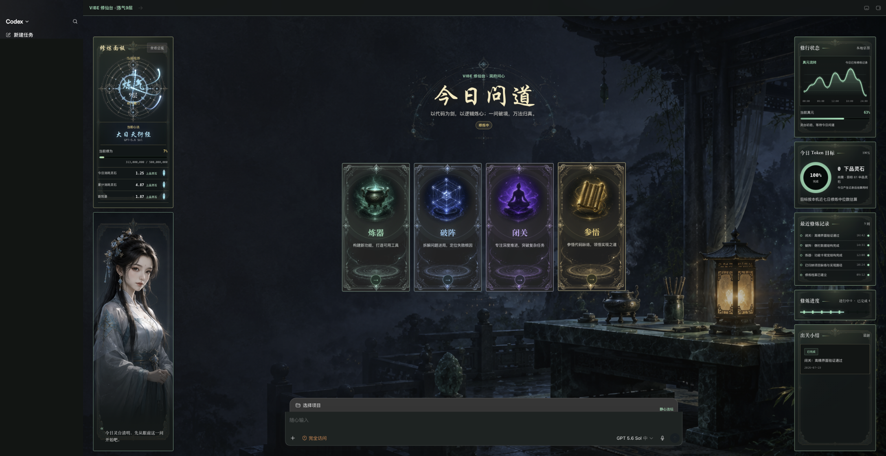
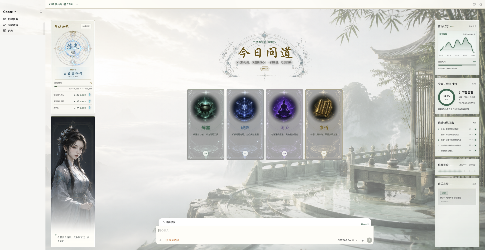
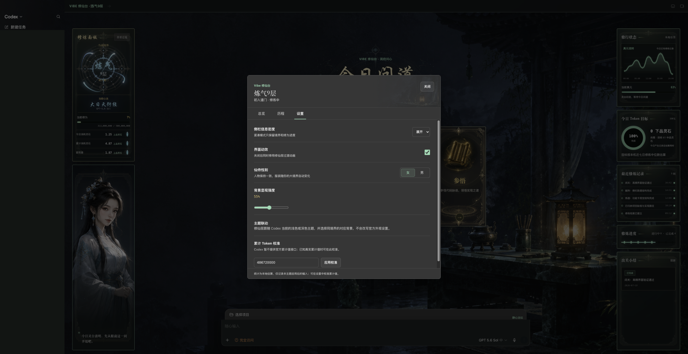

# Codex Cultivation

把 Codex Desktop 的 Vibe Coding 体验改造成一套本地修仙成长系统。

项目目标是为 Codex Desktop 提供跨平台的修仙化工作体验。Windows 与 macOS 版本均使用可逆的本机 CDP 注入，不修改官方应用包。

Windows 实现通过本机 Chromium DevTools Protocol 注入可逆的界面层，不修改官方 `WindowsApps`、`app.asar`、签名、账号、任务记录或插件数据。

## 功能

- 四区响应式首页：官方导航、修炼面板与仙侍、中央问道区、右侧修行状态。
- 四张真实功能卡：炼器、破阵、闭关、参悟，继续调用 Codex 原生功能。
- Token 本地估算与下品、中品、上品、极品灵石换算，并使用四种独立灵石美术。
- 炼气、筑基、金丹、元婴、化神境界与小境界进度。
- 五个境界均包含独立深色/浅色 16:9 背景，共 10 张环境美术。
- 顿悟机缘、连续三日天劫、失败修为惩罚和飞升状态。
- 七日 Token 折线、今日目标环图、最近历程与累计 Token 手动校准。
- 浅色白玉/青瓷与深色玄夜/墨玉两套视觉系统，跟随 Codex 最终主题。
- 男/女仙侍设置与按大境界自动换装的 10 张一致性人物立绘。
- 按当前模型切换心法名称，并从 Codex 原生模型选择控件读取结果。
- 阵盘使用 Canvas 绘制四道穿心 8 字真元：两道正向、两道反向，光点领头并生成动态历史拖尾。
- 可逆安装、托盘控制、验证截图和完整恢复。

## 心法列表

首页会读取 Codex 当前选择的模型并自动切换心法名称，不额外维护一套模型设置。

| 模型 | 心法名称 |
| --- | --- |
| GPT-5.4 mini | **灵犀轻云诀** |
| GPT-5.5 | **紫府通玄经** |
| GPT-5.6 Luna | **月华流光诀** |
| GPT-5.6 Terra | **地脉归元经** |
| GPT-5.6 Sol | **大日天衍经** |

无法识别的模型会保留原始模型名，并将心法回退为「清心诀」。

## 效果预览

| 深色玄夜主题 | 浅色白玉主题 |
| --- | --- |
|  |  |



展示图使用虚构修炼数据，左侧历史任务区域已遮挡处理。

## 平台状态

- Windows：与 macOS 共用完整修仙界面、状态机和美术资源，保留 Store 包校验、托盘控制与 PowerShell 安装/恢复流程。
- macOS：支持安装检查、启动、验证、暂停、背景导入、菜单栏控制与完整恢复。

## macOS 系统要求

- macOS 13 或更新版本
- 官方 Codex Desktop，安装于 `/Applications/ChatGPT.app`
- Node.js 22 或更新版本
- Xcode Command Line Tools（仅菜单栏控制器需要 Swift）

## macOS 安装

首次运行：

```zsh
./macos/scripts/install-codex-cultivation.command
./macos/scripts/start-codex-cultivation.command
```

Codex 已打开时，启动器会通过 macOS 原生对话框请求一次重启确认。也可以打开菜单栏控制器：

```zsh
./macos/scripts/menubar-codex-cultivation.command
```

验证和截图：

```zsh
./macos/scripts/verify-codex-cultivation.command \
  --screenshot "$PWD/codex-cultivation-check.png"
```

恢复官方界面并关闭调试会话：

```zsh
./macos/scripts/restore-codex-cultivation.command
```

## Windows 系统要求

- Windows 10/11
- Microsoft Store 版 Codex Desktop
- Node.js 22 或更新版本
- 推荐 PowerShell 7

## 安装

关闭 Codex 后运行：

```powershell
powershell -NoProfile -ExecutionPolicy Bypass -File .\windows\scripts\install-codex-cultivation.ps1
```

安装完成后使用桌面快捷方式，或运行：

```powershell
powershell -NoProfile -ExecutionPolicy Bypass -File .\windows\scripts\start-codex-cultivation.ps1
```

如果 Codex 已打开，脚本会明确询问是否重启；命令行自动化必须显式传入 `-RestartExisting`。

## 验证

```powershell
powershell -NoProfile -ExecutionPolicy Bypass -File .\windows\scripts\verify-codex-cultivation.ps1 `
  -ScreenshotPath "$PWD\codex-cultivation-check.png"
```

## 恢复

```powershell
powershell -NoProfile -ExecutionPolicy Bypass -File .\windows\scripts\restore-codex-cultivation.ps1
```

恢复会移除实时注入并关闭保存的 CDP 会话。需要恢复安装前的官方外观键时使用 `-RestoreBaseTheme`。

## 境界升级规则

修为来自修仙台启用后对输入 Token 的本地估算。达到小境界门槛时自动进阶；达到大境界上限后不会直接升级，而是进入三日天劫。

| 境界 | 修为区间 | 小境界 |
| --- | ---: | --- |
| 炼气 | 0 ～ 5 亿 | 炼气 1～9 层 |
| 筑基 | 5 亿 ～ 20 亿 | 初期、中期、后期、圆满 |
| 金丹 | 20 亿 ～ 80 亿 | 初期、中期、后期、圆满 |
| 元婴 | 80 亿 ～ 320 亿 | 初期、中期、后期、圆满 |
| 化神 | 320 亿 ～ 1,280 亿 | 初期、中期、后期、圆满 |

### 小境界

- 炼气九层门槛依次为：500 万、1,500 万、3,000 万、5,000 万、8,000 万、1.25 亿、1.9 亿、3 亿、5 亿 Token。
- 筑基及以后，每个大境界按当前跨度的 20%、55%、90%、100% 划分为初期、中期、后期、圆满。
- 普通小境界达到门槛后自动进阶，不需要额外操作。

### 顿悟

- 每次有效输入后有 1.2% 概率发现顿悟机缘，两次顿悟至少间隔七天。
- 顿悟需要在修炼总览中主动领取，可直接推进到下一个小境界门槛。
- 若已处于当前大境界最后阶段，顿悟只会补满修为并开启天劫，不会跳过渡劫直接升级。

### 三日天劫

- 修为到达大境界上限后立即锁定当前境界，并开启连续三日天劫。
- 每日目标取最近七个有修炼记录日的 Token 中位数的 80%，向 100 Token 取整，最低为 1,000 Token。
- 连续三天每天达到目标即渡劫成功；天劫期间新增修为暂存为溢出修为，成功后带入下一境界。
- 任一已结束的目标日未达标即渡劫失败：扣除当前大境界跨度的 12% 修为，并清空天劫期间的溢出修为。
- 化神圆满后完成最终三日天劫，即标记为飞升。

累计 Token 可以在「修炼总览 → 设置 → Token 数据校准」中手动修正；安装 CC Switch 后，也可同步累计、最近 60 天和可用的小时统计。校准只调整当前修为起点，不补算历史顿悟或天劫。

## 数据说明

Codex Desktop 当前没有公开的账号累计 Token 接口。本项目默认按启用后的输入长度进行本地估算，并允许手动校准累计值；也可只读接入 CC Switch 从本机会话日志整理出的 Codex Token 统计。该数据仅覆盖本机可用的会话历史，不等同于账号级官方累计值。界面不会伪造工具调用、任务数量或官方 Token 数据。

Windows 状态保存在 `%LOCALAPPDATA%\CodexCultivation`，macOS 状态保存在 `~/Library/Application Support/CodexCultivation`。

## 生图素材

`windows/references/cultivation-art-prompts.json` 包含境界背景、仙侍母版和四张法器图的提示词。

`windows/scripts/request-cultivation-art.ps1` 会请求 URL、下载 HTTPS 图片、验证文件、归一化尺寸并接入 `windows/assets/cultivation/`。脚本不会自动重试结果不确定的 POST，也不会保存 API 密钥。请只通过本机环境变量配置 `IMAGE_API_URL` 和 `IMAGE_API_KEY`。

## 安全边界

- CDP 只绑定 `127.0.0.1`，并校验 Store 包、监听进程、端口和 Browser ID。
- 不修改或接管 `WindowsApps` 文件。
- 配置文件按严格 UTF-8、原子替换和可恢复备份处理。
- 不提交 API 密钥、`auth.json`、用户任务内容、个人截图或本地状态文件。
- 不使用时建议执行恢复脚本关闭调试会话。

## 测试

```powershell
pwsh -NoProfile -File .\windows\tests\run-tests.ps1
node --check .\windows\scripts\injector.mjs
node --check .\windows\assets\renderer-inject.js
node .\windows\tests\renderer-inject.test.mjs
node .\windows\scripts\injector.mjs --check-payload
```

当前版本：`1.8.0`

自动化测试要求五个境界的深浅背景、男女五境界仙侍、四张功能卡、四种灵石与阵盘资源完整存在。运行时仍保留素材回退，不影响 Codex 原生工作区。

## 来源与权利

本仓库使用全新的 Git 历史，并针对修仙系统重新整理。部分底层安全注入思路源自公开项目 Codex Dream Skin。详细边界见 [NOTICE.md](./NOTICE.md)。本项目不代表 OpenAI 或 Codex 官方产品、主题或背书。
